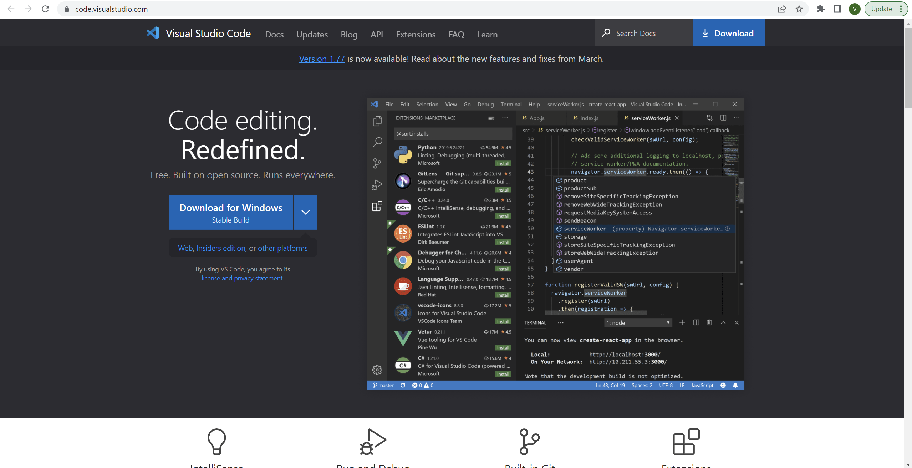
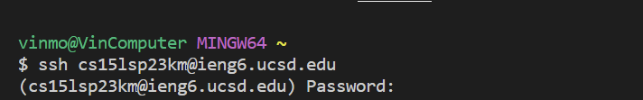

# CS15l Login Tutorial
## Step 1: Installing VScode
- To install VScode the first thing you must do is go to the VScode website [here](https://code.visualstudio.com/).
- The page should look like this:

- Press the download button for whichever operating system you are using and you should be able to open and use it.

## Step 2: Remotely Connecting
- If you're on windows you must first use this [link](https://gitforwindows.org/) to download and install Git for Windows.
- You can refer to this [link](https://stackoverflow.com/a/50527994) to start using git for windows.
- Now that everything is set up you can use ssh in the bash terminal to __remotely connect__ to your cs account.
- In the bash terminal input `ssh cs15lsp23zz@ieng6.ucsd.edu` after the $ Character. (replace the zz in the username with your specific characters in your CS username. This username can be found by using the UCSD account lookup tool [here](https://sdacs.ucsd.edu/~icc/index.php))
- It should look like this: 

- Input the password in the terminal and you will remote connect.

## Step 3: Trying Some Commands.
- Now the final step is to try some commands in the console.
- Here is a few you could try:

- `cd ~` : This command changes your current directory to that of the home directory ("~" represents the home directory).
- `cd` : This command can change your similar to the command above. If you add a path after the command it will change your directory to the one you provided a path to.
- `ls -lat` : displays all files and directories in current working directory in a long format. They are displayed based on which were modified most recently.
- `ls -a` : This displays what the command above does with the inclusion og hidden files and directories.
- `pwd`: This prints the current working directory with the absolute path.

- In the following screenshot I tried `ls -lat` and `pwd` (FYI I am not running it from the cs account because it says that the account is closed by remote host)

_In the image above I used `ls -lat` first to display the files which you can see under the command and then `pwd` to show my current working directory which is also observable below the command_

You can try any number of commands at the terminal and see what they do!
