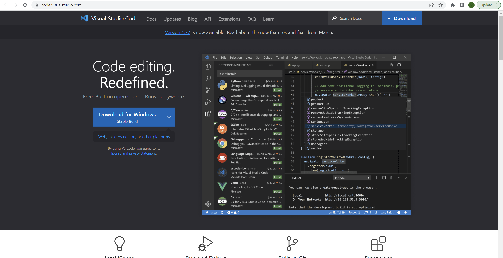

# ieng6 Login Tutorial
## Step 1: Installing VScode
- To install VScode the first thing you must do is go to the VScode website [here](https://code.visualstudio.com/)
- The page should look like this:

