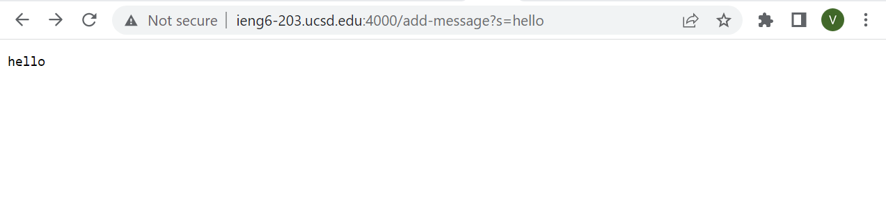
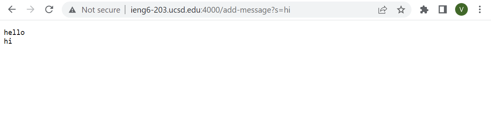
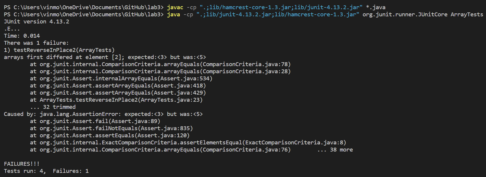

# CS15l Lab Report 2
## Part 1

Here is the code for StringSearch

```
import java.io.IOException;
import java.net.URI;

class Handler implements URLHandler {
    String str="";

    public String handleRequest(URI url) {
        if (url.getPath().contains("/add-message")) {
            String[] parameters = url.getQuery().split("=");
            if (parameters[0].equals("s")) {
                str += parameters[1]+"\n";
                return str;
            }
        }
        return "404 Not Found!";
        
        
    }
}

class StringSearch {
    public static void main(String[] args) throws IOException {
        if(args.length == 0){
            System.out.println("Missing port number! Try any number between 1024 to 49151");
            return;
        }

        int port = Integer.parseInt(args[0]);

        Server.start(port, new Handler());
    }
}
```



- In this case it is the `handleRequest` method being called and within that getPath(), contains and getQuery are also being called
- The argument for the `handleRequest` (the only method with arguments) method is the url itself and then there are two relevant fields: `str` and `parameters`
- `str` is first initiated and set to "" before the method is run and then the method changes it's value to "hello"+"\n".
- `parameters` is a string array initiated in the method with its two elements being from the query: "s" and "hello". 



- In this case the same methods and fields are present, but the fields are different values.
- `str` is equal to "hello"+"\n" before the url is inputted and then it is changed to "hello"+"\n"+"hi"
- `parameters` is a string array initiated in the method with its two elements being from the query: "s" and "hi".

## Part 2

This is one test to showcase the failure inducing input (`input1`)
```
@Test  
  public void testReverseInPlace2() {
    int[] input1 = { 3, 4, 5 };
    ArrayExamples.reverseInPlace(input1);
    assertArrayEquals(new int[]{ 5, 4, 3 }, input1);
  }
  
```

Another test to showcase a non failure inducing input (`input2`)
```
@Test  
  public void testReverseInPlace2() {
    int[] input2 = { 3, 4, 3 };
    ArrayExamples.reverseInPlace(input2);
    assertArrayEquals(new int[]{ 3, 4, 3 }, input2);
  }
```

Running the Junit test responds with this:




My new code to make it work is this:

```
static void reverseInPlace(int[] arr) {
    for(int i = 0; i < arr.length/2; i += 1) {
      int temp=arr[i];
      arr[i] = arr[arr.length - i - 1];
      arr[arr.length - i - 1]=temp;
    }
  }
```
Prior to this the code was:

```
static void reverseInPlace(int[] arr) {
    for(int i = 0; i < arr.length/2; i += 1) {
      arr[i] = arr[arr.length - i - 1];
    }
  }
```

## Part 3
I came in with little to no experience related to like web development, so the idea of setting up a server is really interesting to me. I find the idea of queries fascinating and am interested to see the way in which they could be used in more complicated ways. Generally it is just interesting to take a peak under the hood to see how these things really work.
