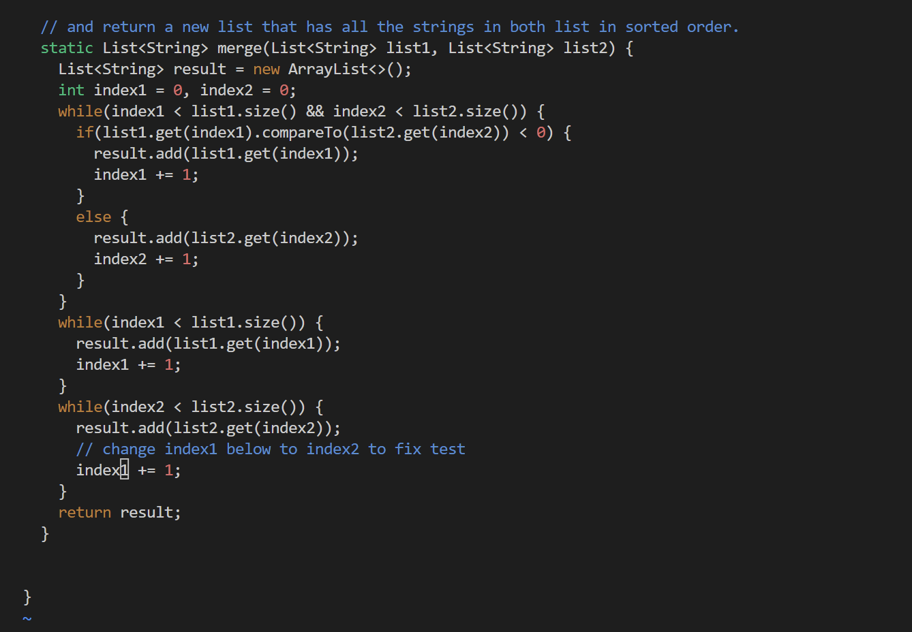

# Lab Report 4

## Logging into ieng6 account

Logging into the account was as simple as opening the terminal and putting `ssh cs15lsp23km@ieng6.ucsd.edu<enter>` followed by entering my password and hitting `<enter>`

## Cloning the repo

To clone the repository that I forked I inputted `git clone https://github.com/VinMoeMac/lab7<enter>`

## Running test

To switch directors to that of the lab I inputted `cd lab7<enter>` and then ran the bash script with the input `bash test.sh<enter>`

## Opening vim

To edit ListExamples.java from the terminal I inputted `vim ListExamples.java<enter>` which takes me to the next screenshot.

## Code before change

To get here I scrolled with the cursor and then used the cursor to click the `1` that I needed to change.

## Code after change

To make the change seen I inputted `x` to delete the `1` and then entered insert mode with `i` and pressed `2` to insert the character as instructed. To go back to normal mode I hit `<esc>` then `:wq` to quit vim and save changes. 

## Running test post change

To check the changes were successful I ran the bash script with the input `bash test.sh<enter>` and it confirmed that both tests passed

## Git Commands to change the repo

To commit and push the changes to my account I first had to add the changed java file with the command `git add ListExamples.java<enter>` and then to commit I inputted `git commit -m "Fix merge method"<enter>` and finally I used a final github push with `git push<enter>`

